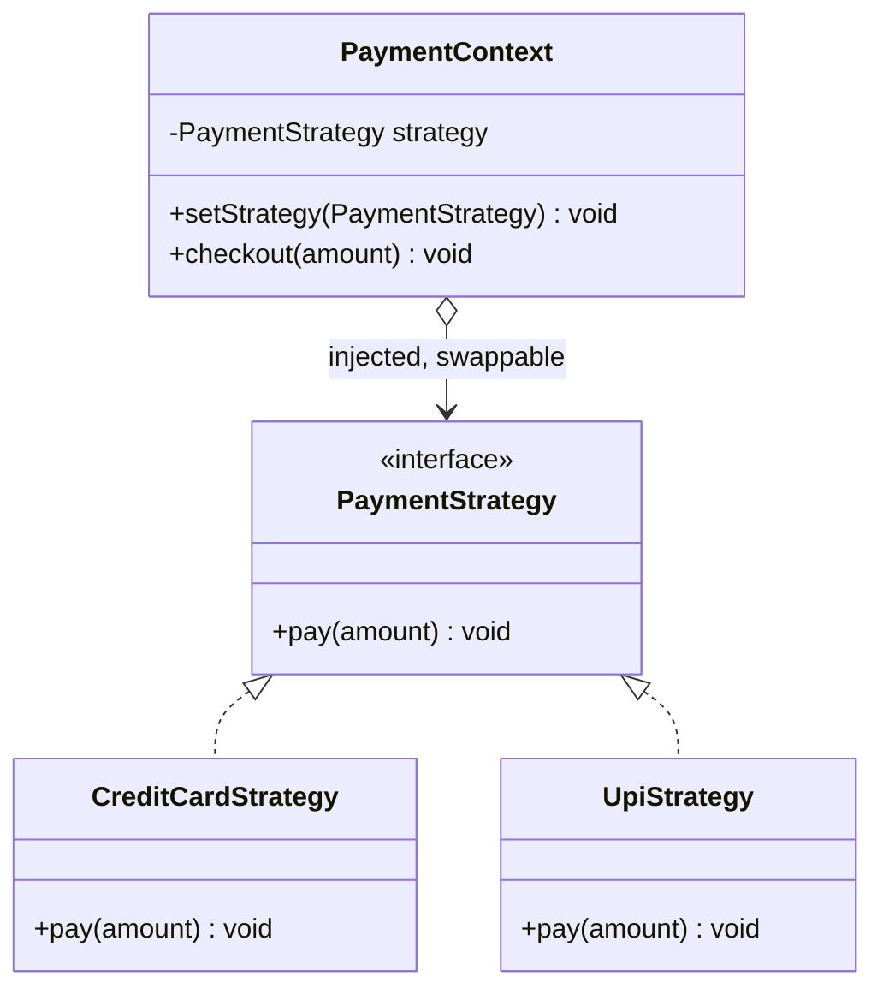
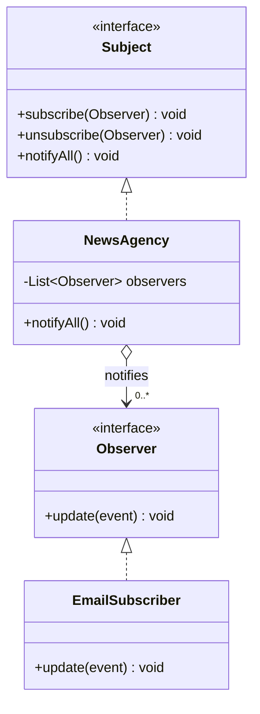
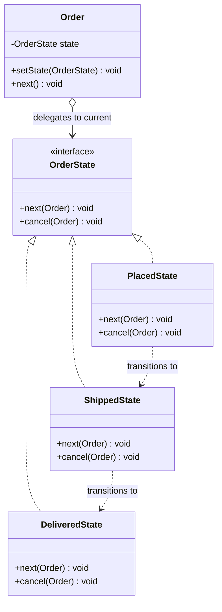
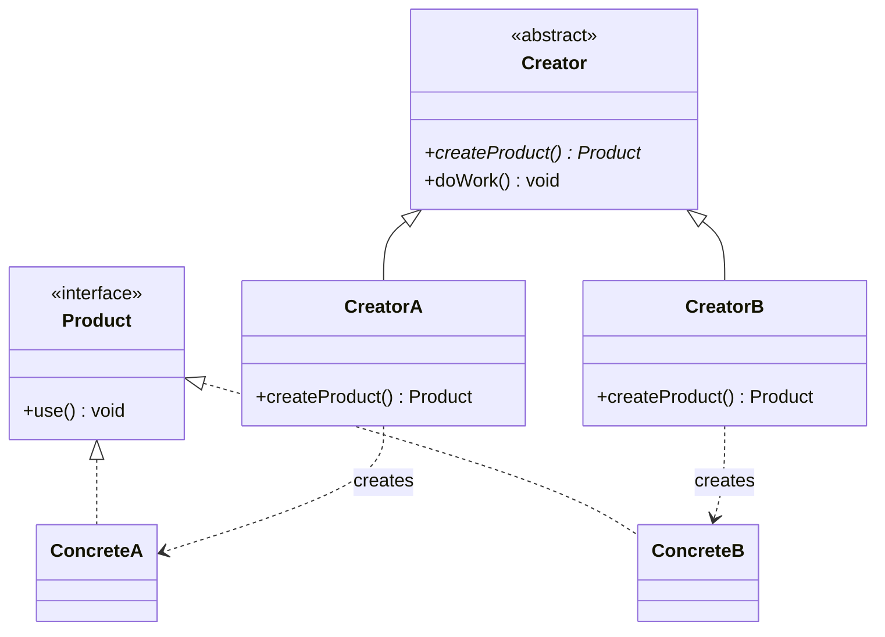
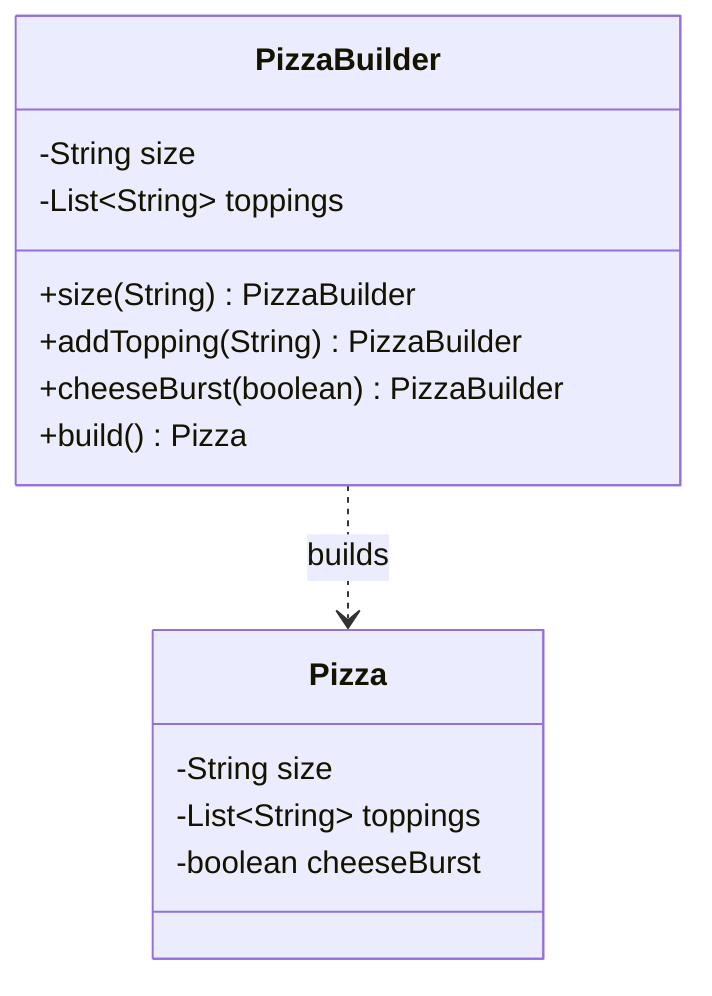
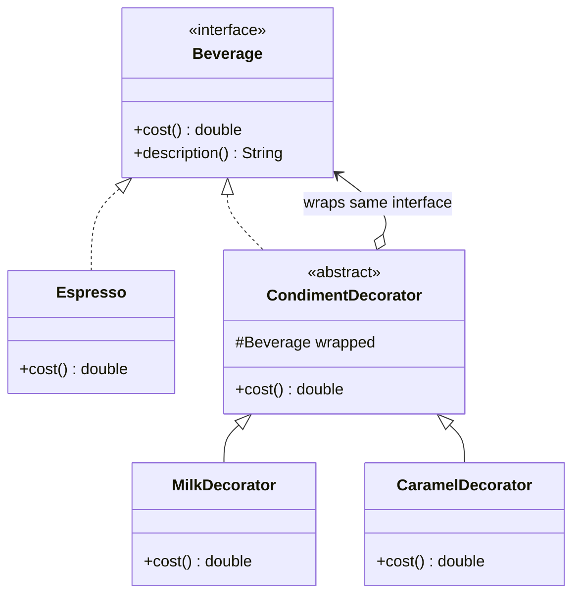
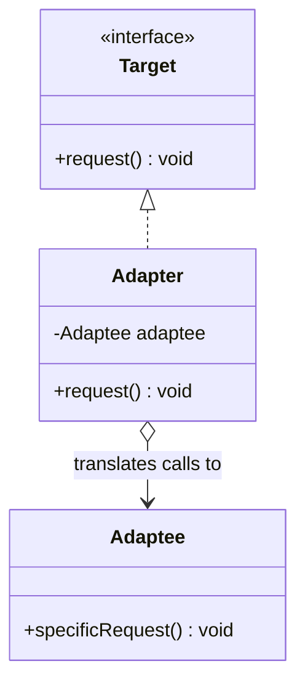
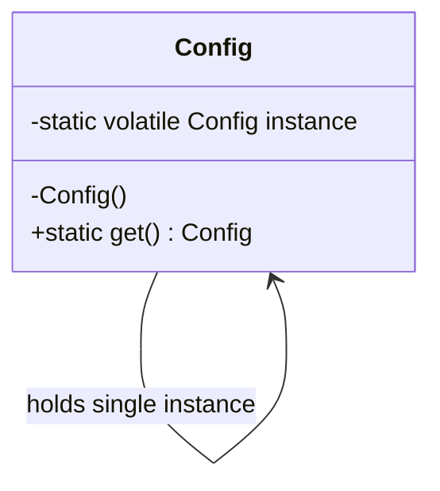
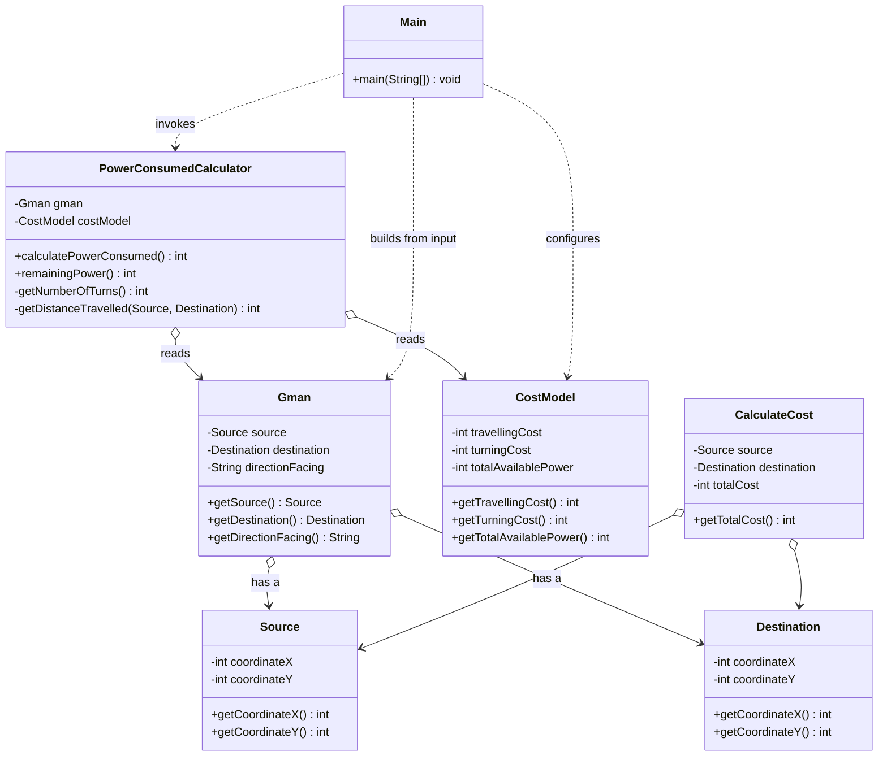

# LLD Quick-Recall Sheet — 23 GoF Patterns + Concurrency

**How to use this:** Don't memorize definitions. Memorize the *problem signal* (left column). In an interview the interviewer describes a problem; your job is to hear the smell and reach for the pattern. Drill the ⭐ rows first — those are the ones that actually come up.

Priority key: ⭐⭐⭐ = interview-frequent, know cold · ⭐⭐ = useful, know the trigger · ⭐ = know it exists, recognize the name.

> Jump to the rendered [class diagrams](#class-diagrams-mermaid) further down for the visual shape of the core patterns, plus a [worked example](#worked-example--gman-project-in-this-repo) drawn from the `GMan` project in this repo.

---

## CREATIONAL (how objects get made)

| Pattern | Problem signal (the smell) | Mechanism (one line) | Memory hook | Pri |
|---|---|---|---|---|
| **Singleton** | "Exactly one instance, global access" — config, connection pool, logger | Private constructor + static accessor; control instantiation | One and only one | ⭐⭐⭐ |
| **Factory Method** | "Create an object but let subclasses decide which" — type known at runtime | Defer instantiation to a `create()` method overridden per subclass | Subclass picks the product | ⭐⭐⭐ |
| **Abstract Factory** | "Create *families* of related objects that must match" — UI kits, DB drivers | Factory of factories; one call returns a coherent set | Factory of factories | ⭐⭐ |
| **Builder** | "Object with many optional params / step-by-step construction" — telescoping constructors | Fluent `.setX().build()`; separates construction from representation | Step-by-step, fluent | ⭐⭐⭐ |
| **Prototype** | "Cloning is cheaper than constructing from scratch" | Implement `clone()`; copy an existing instance | Copy, don't build | ⭐ |

---

## STRUCTURAL (how objects are composed)

| Pattern | Problem signal (the smell) | Mechanism (one line) | Memory hook | Pri |
|---|---|---|---|---|
| **Adapter** | "Two incompatible interfaces need to talk" — legacy/3rd-party API | Wrapper translates one interface into another | Power plug adapter | ⭐⭐⭐ |
| **Decorator** | "Add behavior at runtime without subclass explosion" — add-ons, toppings | Wrap object in same-interface wrappers, stack them | Russian dolls / coffee toppings | ⭐⭐⭐ |
| **Facade** | "Simplify a messy complex subsystem behind one door" | Single high-level interface over many classes | One front door | ⭐⭐ |
| **Proxy** | "Control access to an object" — lazy load, caching, access control, remote | Stand-in with same interface; intercepts calls | Stand-in / gatekeeper | ⭐⭐ |
| **Composite** | "Treat individual objects and groups uniformly" — trees, file systems, menus | Leaf + container share an interface; recurse | Tree where node == leaf | ⭐⭐ |
| **Bridge** | "Two dimensions vary independently" — shape × color, device × remote | Split abstraction from implementation, compose them | Two axes, one bridge | ⭐ |
| **Flyweight** | "Tons of objects, mostly shared state, memory blows up" | Share intrinsic state; pass extrinsic state in | Share the common part | ⭐ |

---

## BEHAVIORAL (how objects interact / distribute responsibility)

| Pattern | Problem signal (the smell) | Mechanism (one line) | Memory hook | Pri |
|---|---|---|---|---|
| **Strategy** | "Multiple interchangeable algorithms, swap at runtime" — payment methods, sort, pricing | Encapsulate each algo behind a common interface, inject it | Swappable algorithm | ⭐⭐⭐ |
| **Observer** | "When X changes, notify many dependents" — events, pub/sub, UI updates | Subject keeps subscriber list, pushes updates | Subscribe / notify | ⭐⭐⭐ |
| **State** | "Behavior changes based on internal state" — order lifecycle, vending machine, traffic light | Each state is a class; object delegates to current state | Object that changes behavior with mode | ⭐⭐⭐ |
| **Command** | "Encapsulate a request as an object" — undo/redo, queues, scheduling | Wrap action + params in a command object with `execute()` | Action as an object | ⭐⭐ |
| **Chain of Responsibility** | "Pass request along handlers until one handles it" — middleware, approval flow, filters | Linked handlers, each decides handle-or-pass | Pass the buck down the chain | ⭐⭐ |
| **Template Method** | "Fixed algorithm skeleton, vary a few steps" — frameworks, processing pipelines | Base defines skeleton, subclasses fill `hook()` steps | Fill-in-the-blanks recipe | ⭐⭐ |
| **Iterator** | "Traverse a collection without exposing internals" | Provide `hasNext()/next()` over any structure | Cursor over a collection | ⭐⭐ |
| **Mediator** | "Many objects talk to each other → spaghetti" — chat room, air traffic control | Central hub coordinates; objects only know the mediator | Air traffic controller | ⭐ |
| **Memento** | "Save & restore an object's state" — snapshots, checkpoints, undo | Capture state in an opaque token, restore later | Save point | ⭐ |
| **Visitor** | "Add operations to a class hierarchy without changing it" | Externalize operation into a visitor; `accept(visitor)` | Guest who acts on each element | ⭐ |
| **Interpreter** | "Evaluate sentences in a small language/grammar" — expression eval, rules engine | Class per grammar rule, recurse over a parse tree | Tiny language evaluator | ⭐ |

---

## The 8 to know cold (drill these first)
Singleton · Factory Method · Builder · Adapter · Decorator · Strategy · Observer · State.
If asked "design X," these cover ~80% of LLD answers. Strategy + State + Observer alone solve a huge fraction of "design a vending machine / parking lot / order system" prompts.

## Fast disambiguation (the pairs people confuse)
- **Strategy vs State:** Strategy = *you* pick the algorithm and it doesn't change itself. State = the object *transitions* itself between behaviors.
- **Decorator vs Proxy:** Both wrap. Decorator *adds* behavior; Proxy *controls access* (same behavior, gated).
- **Factory Method vs Abstract Factory:** Factory Method = one product, subclass decides. Abstract Factory = a *family* of products that must be consistent.
- **Adapter vs Facade:** Adapter makes one incompatible thing fit; Facade simplifies many things behind one interface.
- **Decorator vs Chain of Responsibility:** Decorator — everyone in the stack acts. Chain — one handler acts, then it stops (or passes).

---

# Class Diagrams (Mermaid)

These render on GitHub. They show the *shape* of each pattern — read the arrows: solid line + hollow triangle = inheritance/implements, solid line + arrow = "has a" reference. Below the GoF cores there's a [worked example](#worked-example--gman-project-in-this-repo) built from real code in this repo.

## Strategy



## Observer



## State



## Factory Method



## Builder



## Decorator



## Adapter



## Singleton



---

# Worked Example — `GMan` project (in this repo)

Source: [`lld/GeekTrust/GMan`](./GeekTrust/GMan). A Geektrust problem where a robot (`Gman`) moves from a `Source` to a `Destination` and we compute remaining power. It's a clean, layered (Entity / Model / Utils) example — handy to point at when an interviewer asks "show me how you'd structure a small LLD."



**Reading the design:**
- `Gman` is the aggregate root — it *has a* `Source`, a `Destination`, and a facing direction.
- `CostModel` is a value object holding the cost knobs (travelling cost, turning cost, available power).
- `PowerConsumedCalculator` is the **service/strategy-ish** layer: it takes a `Gman` + `CostModel` and computes turns, distance, and remaining power. Keeping this out of the entities keeps `Gman` a plain data holder (SRP).
- `Main` is the I/O / command-parsing boundary (`SOURCE`, `DESTINATION`, `PRINT_POWER`) — it assembles objects and calls the calculator. This is essentially a tiny **Command-dispatch** loop over text input.

**LLD talking points this example earns you:**
- Clear package layering: `Entity` (data) / `Model` / `Utils` (behavior) / `Main` (I/O).
- Single Responsibility: entities hold state, the calculator holds logic.
- Easy to extend: a new command is a new `case`; a different cost scheme is a new `CostModel` instance — natural seam to introduce a **Strategy** if turn/distance rules diverge.

---

# CONCURRENCY SHEET (Java backend focus)

## Core mental model
- **Race condition:** outcome depends on thread timing on shared mutable state.
- **Critical section:** code that must run atomically → guard it.
- **Visibility vs atomicity:** `volatile` gives *visibility* (threads see latest value) but NOT *atomicity* (`i++` is still 3 ops). `synchronized`/locks give both.
- **Happens-before:** the JMM rule that guarantees one thread's writes are visible to another (via `synchronized`, `volatile`, `Thread.start/join`, final fields).

## Primitives — when to reach for what

| Tool | Use when | Note |
|---|---|---|
| `synchronized` | Simple mutual exclusion on a block/method | Reentrant; releases on exit/exception; can't try-or-timeout |
| `ReentrantLock` | Need `tryLock`, timeout, interruptible, or fairness | Must `unlock()` in `finally` |
| `ReadWriteLock` | Many readers, few writers | Readers share; writer exclusive |
| `volatile` | One thread writes a flag, others read it | Visibility only, NOT compound actions |
| `AtomicInteger/Long/Reference` | Lock-free counters / CAS updates | `incrementAndGet`, `compareAndSet` |
| `synchronized` + `wait/notify` | Classic producer-consumer by hand | Always `wait()` in a `while` loop, not `if` |
| `Semaphore` | Limit N concurrent users of a resource | `acquire()/release()`; rate/pool limiting |
| `CountDownLatch` | Wait for N tasks to finish once | One-shot, can't reset |
| `CyclicBarrier` | N threads wait for each other, repeatedly | Reusable; runs an optional barrier action |
| `BlockingQueue` (`ArrayBlockingQueue`, `LinkedBlockingQueue`) | Producer-consumer — **prefer this over wait/notify** | `put()`/`take()` block automatically |
| `ConcurrentHashMap` | Concurrent map access | Don't external-lock a plain HashMap |
| `ExecutorService` / thread pools | Anything real — don't `new Thread()` | `Executors.newFixedThreadPool(n)` |
| `CompletableFuture` | Async composition, chaining, combining | `thenApply`, `thenCompose`, `allOf` |

## Deadlock — the 4 conditions (break any one to prevent)
Mutual exclusion · Hold-and-wait · No preemption · Circular wait.
**Most common fix:** impose a global **lock ordering** so circular wait can't form. Or use `tryLock` with timeout and back off.

## Patterns interviewers ask you to build
- **Producer–Consumer** → `BlockingQueue` (clean) or `wait/notify` in a `while` loop (the "do it by hand" version).
- **Bounded resource / connection pool** → `Semaphore(n)`.
- **Rate limiter** → token bucket with `AtomicLong` + timestamps, or `Semaphore` + scheduled refill.
- **Thread-safe Singleton** → `enum` (simplest) or double-checked locking with `volatile` instance.
- **Wait for parallel tasks** → `CountDownLatch` (one-shot) or `CompletableFuture.allOf`.

## Double-checked locking Singleton (know how to write this)
```java
class Config {
  private static volatile Config instance;   // volatile is REQUIRED
  private Config() {}
  static Config get() {
    if (instance == null) {                  // 1st check, no lock
      synchronized (Config.class) {
        if (instance == null) {              // 2nd check, under lock
          instance = new Config();
        }
      }
    }
    return instance;
  }
}
```
Why `volatile`: without it, another thread can see a non-null but partially-constructed object due to instruction reordering.

## Producer–Consumer (the clean version)
```java
BlockingQueue<Task> q = new LinkedBlockingQueue<>(100);
// producer:
q.put(task);     // blocks if full
// consumer:
Task t = q.take(); // blocks if empty
```

## wait/notify rules (if asked the manual version)
1. Only call inside a `synchronized` block on the same monitor.
2. Always wait in a `while (!condition)` loop, never `if` (spurious wakeups + recheck).
3. Prefer `notifyAll()` over `notify()` unless you're certain one waiter is right.

## Quick gotchas to say out loud in interviews
- `i++` is not atomic. `volatile` won't save it — use `AtomicInteger` or a lock.
- `HashMap` under concurrent writes can corrupt / infinite-loop — use `ConcurrentHashMap`.
- Don't catch-and-swallow `InterruptedException` — restore the flag: `Thread.currentThread().interrupt()`.
- Prefer high-level (`ExecutorService`, `BlockingQueue`, `CompletableFuture`) over raw threads + `wait/notify`. Saying this signals senior judgment.
